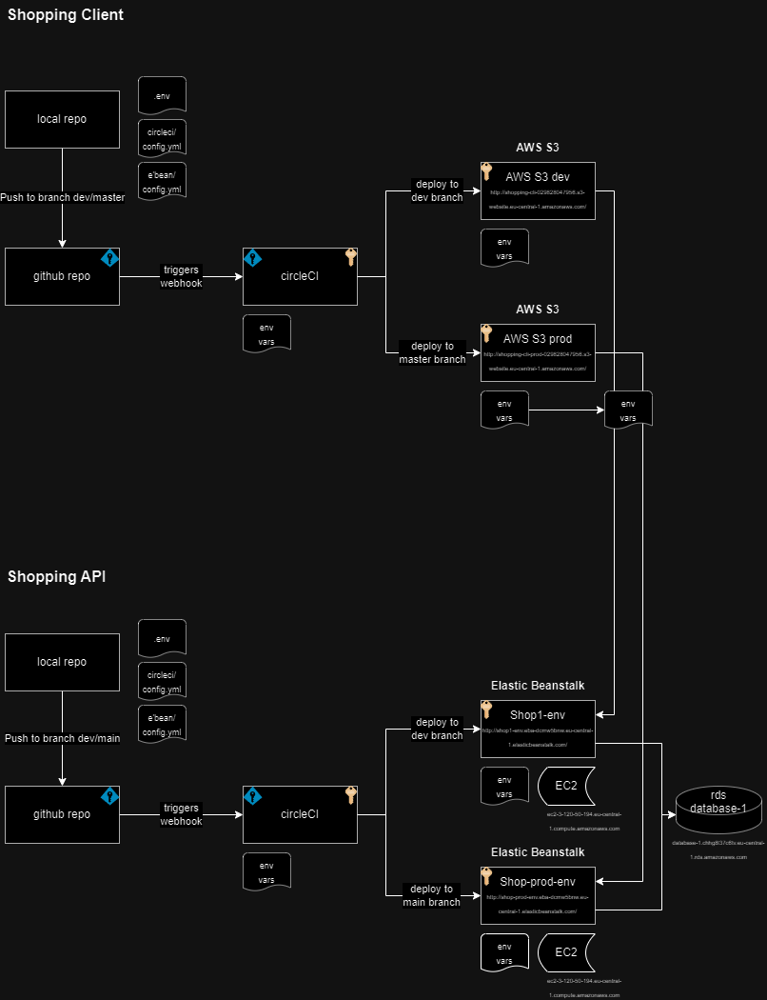
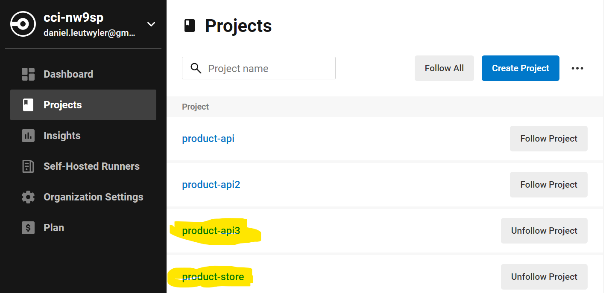
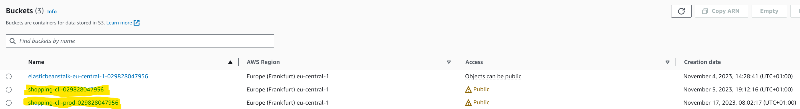
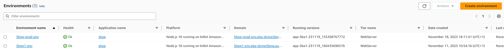
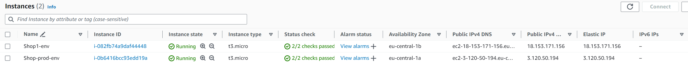
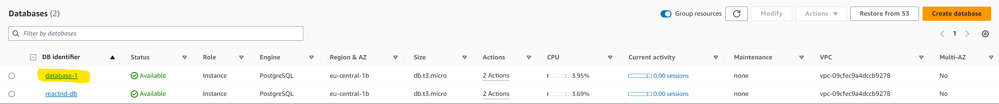

# Architecture Overview of the Shopping app

This document describes all the architectural aspects of the Product-Store app. This app has been developed through out the Udacity Nano degree "Full Stack JavaScript Developer". It includes the documentation of the front end (this project, as well as the API --> Project Link: https://github.com/leuti/product-api)

## Overview of the Components and the Deployment Flow

The product-store is a Udacity project deliverable. I have chosen to build the deployment process on the basis of this app. The product-store offers the basic functions of a webshop and contains of a client project, an API project and a postgre database.

The Client its written AngularJS and interacts with the API. The API runs on node.js and uses a postgres database to store data.

The main repository is stored in github, the deployment is managed by CircleCI and the apps are hosted on AWS. For this project a dev and a prod environment has been setup.

## Github Repo

The project consists of two repos:

| App    | URL                                        |
| ------ | ------------------------------------------ |
| client | https://github.com/leuti/product-store.git |
| API    | https://github.com/leuti/product-api.git   |

## CircleCI

The two Apps are connected to CircleCI

## AWS Setup

### S3 Buckets

The S3 buckets store the client of the product-store:

| Environment | URL                                                                          |
| ----------- | ---------------------------------------------------------------------------- |
| dev         | http://shopping-cli-029828047956.s3-website.eu-central-1.amazonaws.com/      |
| prod        | http://shopping-cli-prod-029828047956.s3-website.eu-central-1.amazonaws.com/ |

For each dev and prod one S3 bucket was created: shopping-cli is the dev bucket; shopping-cli-prod is the production bucket.

### Elastic Beanstalk Environments

The API are hosted on two Elastic Beanstalk environments. The API can be reached as follows:

| Environment | URL                                                                  |
| ----------- | -------------------------------------------------------------------- |
| dev         | http://shop1-env.eba-dcmw5bnw.eu-central-1.elasticbeanstalk.com/     |
| prod        | http://shop-prod-env.eba-dcmw5bnw.eu-central-1.elasticbeanstalk.com/ |

Each EB env has an EC2 instance associated. They can be accessed via SSH on the given addresses:

| Environment | URL                                                            |
| ----------- | -------------------------------------------------------------- |
| dev         | ec2-user@ec2-18-153-171-156.eu-central-1.compute.amazonaws.com |
| prod        | ec2-user@ec2-3-120-50-194.eu-central-1.compute.amazonaws.com   |

### RDS Database

For this project the database-1 is used to store all data. It can be reached under [database-1.chhg8l37c6tv.eu-central-1.rds.amazonaws.com](database-1.chhg8l37c6tv.eu-central-1.rds.amazonaws.com) and contains the databases shopping_dev and shopping_prod:

